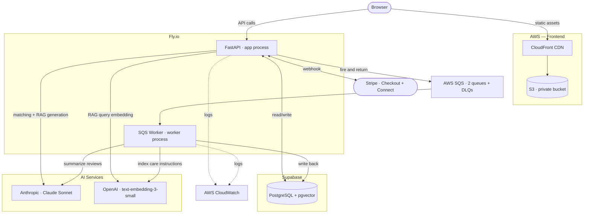

# PawSitter

A full-stack dog sitter marketplace with AI-powered sitter matching, a RAG-grounded care instructions chatbot, and async AI-generated review summaries.

**[Live App](https://d1m0s3pe7745hf.cloudfront.net/)** · **[API Docs](https://dog-sitter-marketplace.fly.dev/docs)** · **[GitHub](https://github.com/surajmahamunigit/dog-sitter-marketplace)**

---

## Overview

PawSitter is a two-sided marketplace where dog owners find, book, and pay sitters — and sitters manage bookings and receive payouts via Stripe Connect. The project focuses on production AI engineering — three AI features run across synchronous and asynchronous paths: sitter matching (structured LLM output), a care instructions chatbot (RAG with vector search), and review summarization (async via SQS). The backend runs FastAPI with PostgreSQL and pgvector; the frontend is React/TypeScript served via AWS CloudFront CDN (S3 origin, private bucket). Both deploy automatically through GitHub Actions with integration tests gating every backend release.

---

## Architecture



---

## Engineering Highlights

- **PostgreSQL + JSONB** stores transactional data (bookings, payments, reviews) and flexible profile data (sitter profiles, dog profiles) in one engine — no second database, no polyglot operational overhead.
- **pgvector** keeps vector search inside the existing PostgreSQL instance — no external vector DB, no network hop, one less dependency to operate.
- **SQL pre-filter before LLM call** narrows candidates by location, dog size, and special-needs flags before Claude sees the shortlist — cuts token cost and avoids LLM attention degradation on long candidate lists.
- **AWS SQS with dead-letter queues** decouples slow AI work from API requests — embedding indexing and review summarization run in background workers, so the API returns immediately and AI latency stays off the request path.
- **GitHub Actions CI/CD with test gating** runs 16 Pytest integration tests against a live pgvector container before deploying to Fly.io — broken builds never reach production.

---

## Tech Stack

| Layer | Technology |
|---|---|
| **Backend** | Python, FastAPI, SQLAlchemy (async), Alembic, Pydantic |
| **Database** | PostgreSQL, JSONB, pgvector |
| **Frontend** | React 18, TypeScript, Tailwind CSS, Vite, React Router, Axios |
| **AI / ML** | Anthropic SDK (Claude Sonnet), OpenAI text-embedding-3-small, pgvector |
| **Payments** | Stripe Checkout, Stripe Connect Express, webhooks |
| **Auth** | JWT, role-based access control (owner / sitter / admin) |
| **Infrastructure** | Docker, Fly.io, AWS S3 + CloudFront, AWS SQS + DLQ, AWS CloudWatch |
| **CI/CD** | GitHub Actions (test → deploy backend, build → deploy frontend) |
| **Maps** | Google Maps API, Haversine distance filtering in PostgreSQL |
| **Testing** | Pytest, pytest-asyncio, HTTPX (16 integration tests) |

---

## Key Technical Decisions

**PostgreSQL + JSONB over MongoDB** — Bookings, payments, and reviews need relational integrity and ACID transactions. Sitter profiles use JSONB for flexible schema within the same engine. One database handles both structured and semi-structured data without a second service.

**pgvector over Pinecone** — Vector search runs inside the existing PostgreSQL instance. No external service, no network hop, no additional billing. The corpus is small (care instructions per dog) — a managed vector database isn't justified at this scale.

**SQL pre-filter before LLM call** — Hard constraints (location radius, dog size, special needs flags) are resolved in PostgreSQL. Only the filtered shortlist (~10 sitters) goes to Claude. This cuts token cost, keeps latency predictable, and avoids the "lost in the middle" attention problem with long candidate lists.

**Direct Anthropic SDK over LangChain** — Every API call is explicit and debuggable. LangChain adds abstraction that obscures request construction, token usage, and error handling. For two well-defined AI features, the direct SDK is the right level of control.

**Multi-provider AI: Anthropic for generation, OpenAI for embeddings** — Claude handles reasoning tasks (matching, summarization). Anthropic does not offer an embedding model, so OpenAI `text-embedding-3-small` handles vector embeddings — purpose-built for that job at lower cost per token. The multi-provider pattern demonstrates choosing the right tool per task rather than defaulting to a single vendor.

**AWS SQS over Celery** — Embedding generation and review summarization run asynchronously via SQS with dead-letter queues for failure handling. SQS is a managed service with no broker dependency (no Redis/RabbitMQ to operate). The worker runs as a separate Fly.io process group using long polling.

**Haversine in PostgreSQL over PostGIS** — Distance filtering runs as a raw SQL formula, fully explainable and dependency-free. PostGIS is the production upgrade path for spatial indexing at scale, but adds operational complexity that isn't justified for a sitter pool of this size.

---

## AI Features

### Sitter Matching

An owner selects one of their dogs. The system loads the dog's profile from the database, pre-filters sitters in PostgreSQL by location radius, accepted dog sizes, and special needs flags, then sends the filtered shortlist (≤10 sitters) to Claude with a structured output prompt. Claude returns ranked matches with per-sitter reasoning explaining why each is a good fit. Results are persisted to a `matches` table for audit.

**Model:** Claude Sonnet · **Temperature:** 0.2 · **Output:** JSON with rankings and reasoning · **End-to-end latency:** 5–7 seconds

### RAG Care Instructions Chatbot

When an owner writes care instructions for their dog, the API returns immediately and an SQS message triggers async processing: the text is chunked using recursive sentence-aware splitting (200-token target, 20-token overlap), embedded via OpenAI, and stored in pgvector. During an active booking, the sitter can ask questions like "How much food does Bella eat?" — the question is embedded with the same model, the top 3 most relevant chunks are retrieved via cosine similarity, and Claude answers grounded strictly in the owner's instructions. If the answer isn't in the context, the model says so rather than hallucinating.

**Embedding model:** OpenAI text-embedding-3-small (1536 dimensions) · **Chunking:** recursive sentence-aware · **Retrieval:** top-3 cosine similarity · **Response latency:** ~1–2 seconds · **Guard:** only accessible during pending or confirmed bookings

### AI Review Summaries

When an owner leaves a review, an SQS message triggers the worker to regenerate a natural-language summary across all of that sitter's reviews. The summary is stored on the sitter's profile and displayed on their public page. The async pipeline keeps the review submission responsive — the API returns immediately while the AI summary generates in the background.

**Model:** Claude Sonnet · **Temperature:** 0.7 · **Pipeline:** SQS → worker → Claude → write to DB

---

## Getting Started

### Prerequisites

- Python 3.12+
- [uv](https://docs.astral.sh/uv/) (Python package manager)
- Node.js 18+ (runtime for npm and Vite)
- Docker (for local PostgreSQL + pgvector)
- Stripe CLI (for webhook forwarding)
- API keys for Anthropic, OpenAI, Google Maps, and Stripe
- AWS credentials with SQS and CloudWatch access

### Environment Variables

Create a `.env` file in the project root with the following backend variables:

```
DATABASE_URL
SYNC_DATABASE_URL
SECRET_KEY
ALGORITHM
ACCESS_TOKEN_EXPIRE_DAYS
APP_ENV
ANTHROPIC_API_KEY
OPENAI_API_KEY
STRIPE_SECRET_KEY
STRIPE_WEBHOOK_SECRET
STRIPE_CONNECT_CLIENT_ID
AWS_ACCESS_KEY_ID
AWS_SECRET_ACCESS_KEY
AWS_REGION
SQS_EMBEDDING_QUEUE_URL
SQS_REVIEW_SUMMARY_QUEUE_URL
```

Create a `frontend/.env` file with the frontend variables:

```
VITE_API_URL=http://localhost:8000
VITE_GOOGLE_MAPS_API_KEY=<your key>
```

### Setup

```bash
# Clone the repository
git clone https://github.com/surajmahamunigit/dog-sitter-marketplace.git
cd dog-sitter-marketplace

# Start PostgreSQL + pgvector locally
docker-compose up -d

# Install backend dependencies
uv sync

# Run database migrations
alembic upgrade head

# Start the backend
uvicorn app.main:app --reload

# In a new terminal — start the SQS worker
python worker.py

# In a new terminal — start the frontend
cd frontend
npm install
npm run dev

# In a new terminal — forward Stripe webhooks
stripe listen --forward-to localhost:8000/payments/webhook
```

**Local URLs:** Frontend `http://localhost:5173` · Backend `http://localhost:8000` · API docs `http://localhost:8000/docs`

---

## Testing

```bash
pytest tests/ -v
```

16 integration tests covering auth, booking lifecycle, sitter search, AI matching, care instructions, reviews, and SQS pipeline mocks. Tests run against a real PostgreSQL + pgvector instance (Docker locally, pgvector service container in CI).

---

## Project Structure

```
├── app/
│   ├── core/              # Config, security (JWT), logging (CloudWatch)
│   ├── models/            # SQLAlchemy models (User, Dog, Booking, Review, Match, etc.)
│   ├── routes/            # FastAPI endpoint handlers
│   ├── schemas/           # Pydantic request/response models
│   └── services/          # Business logic (matching, RAG, reviews, payments, SQS)
├── frontend/
│   └── src/
│       ├── api/           # Axios HTTP clients
│       ├── components/    # Shared React components (Navbar, ProtectedRoute)
│       ├── pages/         # Route-level pages (SitterList, Dashboard, ReviewForm, etc.)
│       ├── routes/        # React Router configuration
│       └── types/         # TypeScript interfaces
├── tests/                 # Pytest integration tests
├── worker.py              # SQS consumer — embedding + review summary pipelines
├── Dockerfile             # Backend container
├── fly.toml               # Fly.io deployment config (app + worker process groups)
└── .github/workflows/     # CI/CD (backend: test → deploy, frontend: build → deploy)
```
